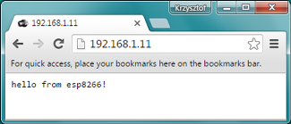
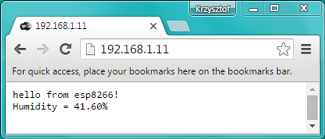

# Show

In [previous section](../4-Measure)  I have shown how to use an inexpensive digital humidity sensor DHT22 with ESP8266 to measure relative humidity. We have been displaying humidity values in Serial Monitor of Arduino IDE.

Now it is time to do next step and use ESP’s Wi-Fi functionality and show humidity values in a web browser. I am really excited to show you that, since it provides freedom to get our measurements online and shown them to the whole world!

Such functionality is also fairly easy to complete. There is an example sketch available in Arduino IDE that demonstrates how to set up a simple web server on an ESP. We will use it to serve a web page with humidity measurement that we or anybody else can open in a web browser :sunglasses:

Let us get started!


## Table of Contents

* [What You Need](#what-you-need)
* [Setup Web Server](#setup-web-server)
* [Test It](#test-tt)
* [Next Step](#next-step)


## What You Need

To implement this part of project you will need the following:

* All the hardware used in [previous section](../4-Measure) to program ESP and to measure humidity:
  * PC with [esp8266/Arduino](https://github.com/esp8266/Arduino) IDE
  * ESP module
  * DHT22 sensor on breadboard
* Wi-Fi access for PC and ESP module to the same network


## Setup Web Server

Start by going to File > Examples > ESP8266WebServer and opening HelloServer.ino sketch.

Update station ID and password in sketch so your ESP can access Wi-Fi network and upload it.

Once upload is complete press Ctrl+Shift+ M to open Serial Monitor. What you are looking for is a message like on screenshot below, that ESP module has connected to Wi-Fi network and IP address of web server running on ESP.


Go ahead, open web browser and type IP address provided on Serial Monitor. If you are connected to the same network you should be able to see “hello from esp8266!” message from ESP module. 



Now go to the sketch and locate function that sends out the “hello” message. What we would like to do, is to change this message, so it contains current humidity value. We will reuse code we tested so far. First please open File > Examples > ESP8266WebServer > HelloServer.ino sketch and save it as OnlineHumidifier-Show.ino. Then open File > Examples > DHT sensor library > DHTtester.ino sketch and copy from it the code we need to print out humidity value. Please see below pieces of code we need.

Declaration section
```cpp
#include "DHT.h"
DHT dht(D2, DHT22);
```

Updated ``` handleRoot() ``` function

```cpp
void handleRoot() {
  digitalWrite(led, LOW);
  String message = "hello from esp8266!\n";
  message += "Humidity = ";
  message += (String) dht.readHumidity();
  message += "%\n\n";
  server.send(200, "text/plain", message);
  digitalWrite(led, HIGH);
}
```

In ``` setup() ``` function

```cpp
dht.begin();
```

To follow exactly how the code was modified please check [OnlineHumidifier-Show.ino]( OnlineHumidifier-Show/OnlineHumidifier-Show.ino) sketch in this repository. 


## Test It

After uploading updated sketch we will be able to see current humidity value each time we open IP address of our ESP in a web browser.




## Next Step

Now you know to use ESP8266 to display current humidity measurement value in a web browser. In section [Chart](../6-Chart) I will show you how to publish individual measurements to a cloud and display them over time on an on-line chart.

