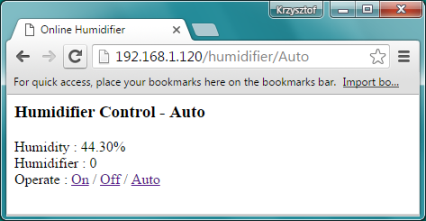
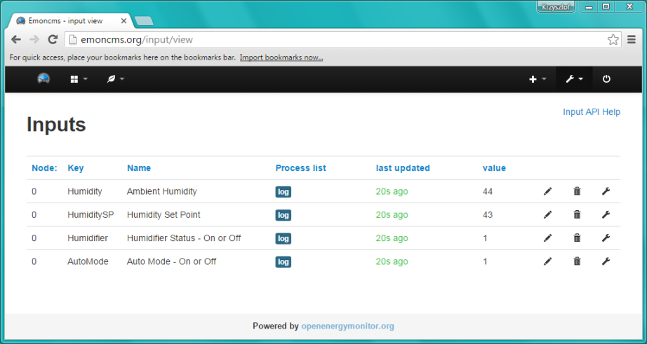
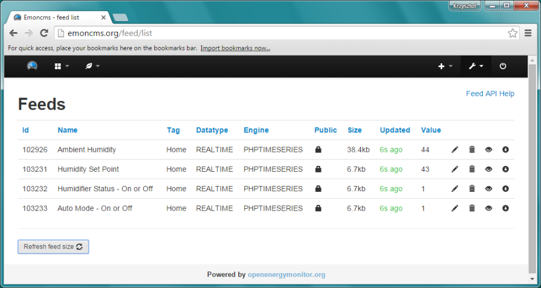

# Automate


## Table of Contents

* [Introduction](#introduction)
* [The Hysteresis Controller](#the-hysteresis-controller)
* [What Else?](#what-else)
* [Let's Get it Work](#lets-get-it-work)
* [Auto Mode On](#auto-mode-on)
* [How does it Perform?](#how-does-it-perform)
* [Next Step](#next-step)


## Introduction

Now comes the fun part of joining all the dots we have been discussing and testing in last seven [sections](https://github.com/krzychb/OnlineHumidifier#step-by-step-tutorial). All we need to do now is to write a simple procedure that will compare ambient humidity against set point and switch humidifier on if it is below or on if it is above the set point.

Before you rush to write this procedure think about humidifier being constantly switched on and off for any swing of humidity. To avoid such situation, it is a common practice to add a dead band below and above the set point and do not operate humidifier if ambient humidity is within the dead band. Exactly the same method of control is used in electric iron or in toilet flush. 

The dead band range above and below the set point is called hysteresis. An automatic controller that is working as desribed above is called [bang–bang controler](https://en.wikipedia.org/wiki/Bang%E2%80%93bang_control) or hysteresis controller.


## The Hysteresis Controller

You can experiment what will happen if you have no hysteresis or if you set it to specific value. At this stage, as a starting point, let us assume a hysteresis of +/- 2% RH.  Below is a procedure that implements hysteresis controller:

```cpp
void executeHumidityControl(void)
{
  Serial.print("Ambient humidity : ");
  Serial.print(humidity, 1);
  Serial.print("%, set point : ");
  Serial.print(humiditySetPoint, 1);
  Serial.print("%, humidifier : ");
  if (humidity > humiditySetPoint + 2)
  {
    // ambient humidity is above the set point
    // action : switch humidifier Off
    humidifier = LOW;
  }
  else if (humidity < humiditySetPoint - 2)
  {
    // ambient humidity is below the set point
    // action : switch humidifier On
    humidifier = HIGH;
  }
  else
  {
    // ambient humidity is within +/- 2% hysteresis
    // therefore do not alter current status of humidifier
    Serial.print("(No Change) ");
  }
  Serial.println(humidifier == HIGH ? "On" : "Off");

  //
  // Operate humidifier connected to RF socket
  //
  actionTransmitter.sendSignal(1, 'A', humidifier);
}
```

## What Else?

We will finally put into operation the last piece of hardware described under [Components](../2-Components), that has not been used so far – the humidifier.  It will act as the final element  of our [control system](https://en.wikipedia.org/wiki/Control_system).

Besides that you will need all the other components used and tested previously.

Speaking in terms of [control system](https://en.wikipedia.org/wiki/Control_system), they will act as controller (ESP8266 running the sketch), the input sensor (DHT22) and the output actuator (RF transmitter together with RF socket).

As the [HMI - Human Machine Interface](https://en.wikipedia.org/wiki/User_interface) we will use a web browser on a PC.


## Let's Get it Work

To start with, open previously prepared [OnlineHumidifier-Control](../7-Control/OnlineHumidifier-Control/) sketch and save it as *OnlineHumidifier-Automate.ino*. Then copy the above code of [hysteresis controller](#the-hysteresis-controller) and add it to the sketch as a separate*Control.ino* file.

To analyse how controller is performing we need to plot humidity values on a chart. We are already familiar how to do it and have the code ready. Copy the file [Emoncms.ino](../6-Chart/OnlineHumidifier-Chart) and add it to the folder with *OnlineHumidifier-Automate.ino* sketch.

Now we need to update *OnlineHumidifier-Automate.ino* sketch so all these files work together. 

To switch controller to auto mode please add handling of additional link as follows:

```cpp
  server.on("/humidifier/Auto", []() {
    autoMode = true;
    showControlScreen();
  });
```

In next step update ``` showControlScreen() ``` procedure to show additional information (controller mode, humidity set point and the new *Auto* link:

```cpp
void showControlScreen(void) {
  String message;
  message += "<html>";
  message += "<head><meta http-equiv='refresh' content='20'/><title>Online Humidifier</title></head>";
  message += "<body>";
  message += "<h3>Humidifier Control - ";
  message += (String) (autoMode == true ? "Auto" : "Manual");
  message += "</h3>";
  message += "<p>";
  message += "Humidity : " + (String) humidity + "%<br />";
  message += "Humidifier : " + (String) humidifier + "<br />";
  message += "Operate : ";
  message += "<a href=\"/humidifier/1\">On</a>";
  message += " / ";
  message += "<a href=\"/humidifier/0\">Off</a>";
  message += " / ";
  message += "<a href=\"/humidifier/Auto\">Auto</a>";
  message += "</body>";
  message += "</html>";

  server.send(200, "text/html", message);
}
```

You will also need to update the ``` loop() ``` to periodically measure humidity, execute control once it is put into auto mode and send data to Emoncms.org:

```cpp
void loop(void)
{
  server.handleClient();

  if (millis() % 20000 == 0)
  {
    measureHumidity();
    if (autoMode == true)
    {
      executeHumidityControl();
    }
    sendDataToEmoncms();
  }
}
```

Plese note we have reduced period of measurement to 20 seconds. This is done with ``` if (millis() % 20000 == 0) ``` statement.

The last setep is to update procedure ``` sendDataToEmoncms() ``` so it sends to Emoncms.org three additional values: humidity set point, status of humidifier (on or off) and information if controller is in auto or manual mode.

```cpp
void sendDataToEmoncms(void)
{
  if (client.connect(emoncmsServer, 80))
  {
    String getJSON = "";
    getJSON += "GET http://" + (String) emoncmsServer;
    getJSON += "/input/post.json?json={";
    getJSON += "Humidity:" + (String) humidity + ",";
    getJSON += "HumiditySP:" + (String) humiditySetPoint + ",";
    getJSON += "Humidifier:" + (String) humidifier + ",";
    getJSON += "AutoMode:" + (String) autoMode;
    getJSON += "}&apikey=" + apiKeyEmoncms + "\n";
    getJSON += "Connection: close\n\n";
    client.print(getJSON);
    (...)

}
```

You will need to do some additional minor updates like declaration and initialization of new variables and switching the auto mode off if you decide to operate the humidifier manually. For details please refer to complete code in [OnlineHumidifier-Automate](OnlineHumidifier-Automate) folder.


## Auto Mode On

Go ahead compile, upload and debug your sketch. Once done, after opening ``` http://IP-of-your-ESP/humidifier/Auto ``` link in web browser you should be able to see a screen as below:




# How does it Perform?

Once sketch is running and ESP is sending data to Emoncms.org, you will soon see new entries under [Inputs](http://emoncms.org/input/view).

Update configuration of collected data as discussed in section [Chart]( ../6-Chart).

Add missing description in column Name under [Inputs](http://emoncms.org/input/view). Such description will then show up in [Feeds](http://emoncms.org/feed/list) and on *MultiGraph* charts and it helps during data analysis.



Add [Inputs](http://emoncms.org/input/view) to [Feeds](http://emoncms.org/feed/list). 



Add *MultiGraph* charts under [Dashboards](http://emoncms.org/dashboard/list)


After completion of the above steps leave your control system running in auto mode for couple of hours. This is to collect data for analysis of performance of your humidity control system. Once you have the data, start tweaking the system and observing how this affects quality of humidity control.

This is fun to observe how control system copes with random disturbances (caused by e.g. opening a window, boiling water in kitchen or washing) and trying to get humidity back to the set point. You may improve time to get humidity back on target by changing hysteresis, output of humidifier, location of humidity sensor and data sampling period.

Consider changing one parameters at a time then collecting data for couple of hours and checking results before moving to next parameter.


## Next Step

In section [Maintain](../9-Maintain) I would like to discuss making the code uploads using OTA (Over the Air). This is quicker and more convenient alternative to uploading using a serial port.

